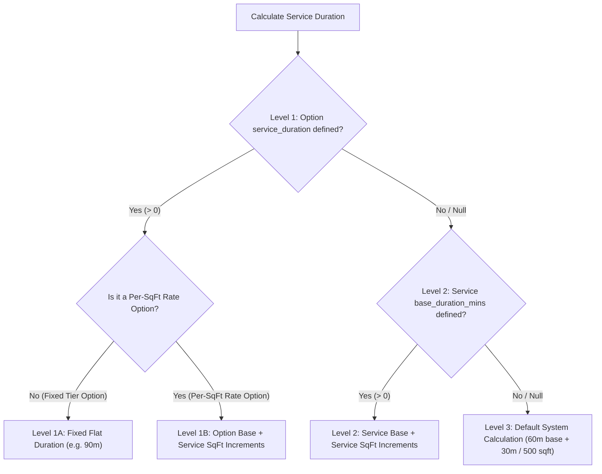
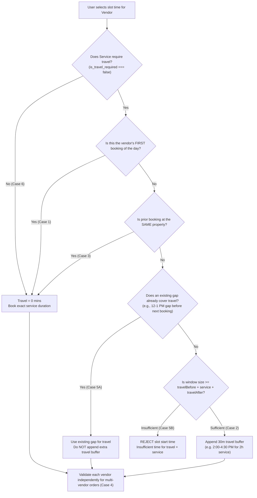
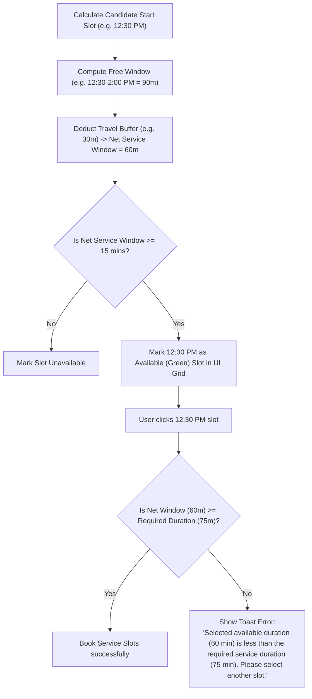

# Summary of Today's Changes & Testing Guide

This document details all technical updates implemented today in the Order Schedule and Calendar modules, their expected behaviors, step-by-step testing instructions, and potential edge cases/regression areas to monitor.

---

## Table of Contents
1. [Feature 1: Calendar Time Axis Trimming (Removing Non-Operating Slots)](#feature-1-calendar-time-axis-trimming)
2. [Feature 2: 3-Tier Priority Hierarchy for Service Duration Calculation](#feature-2-3-tier-priority-hierarchy-for-service-duration-calculation)
3. [Feature 3: Dynamic Vendor Travel Time Adjustment (6 Business Cases)](#feature-3-dynamic-vendor-travel-time-adjustment)
4. [Feature 4: Partial Slot Display & Toast Error Notification](#feature-4-partial-slot-display--toast-error-notification)
5. [Modified Files List](#modified-files-list)
6. [Potential Risks & Regression Areas to Monitor](#potential-risks--regression-areas-to-monitor)

---

## Feature 1: Calendar Time Axis Trimming

### Problem Solved
Previously, FullCalendar rendered 15-minute empty grid rows starting from `12:00 AM` to `12:00 AM` (24 hours) regardless of vendor working hours. Users had to scroll past empty 12 AM – 7 AM rows to see active day slots.

---

## Feature 2: 3-Tier Priority Hierarchy for Service Duration Calculation

---

## Feature 3: Dynamic Vendor Travel Time Adjustment

---

## Feature 4: Partial Slot Display & Toast Error Notification

### Problem Solved
When a vendor has a 90-minute window (e.g. `12:30 PM - 2:00 PM`) between appointments, and 30 minutes of travel is required:
- Net available service window = `90 mins - 30 mins travel = 60 mins`.
- If a user selects a service requiring `75 mins`, the system previously marked `12:30 PM - 2:00 PM` as completely unavailable (gray/hidden), confusing users who saw 1.5 hours free on the calendar.

### Technical Implementation & UX Flow

1. **Slot Display**:
   - Deducts required travel buffer (30m) from available window.
   - If net available service time is at least 15 minutes, renders `12:30 PM` as an **available (green) slot** on the UI calendar grid.
2. **Click Toast Error**:
   - Clicking `12:30 PM` evaluates `availableDurationMins` (60m) vs `requiredDuration` (75m).
   - Shows toast error: `"Selected available duration (60 min) is less than the required service duration (75 min). Please select another slot."`

---

## Step-by-Step Testing Guide

### Feature 4 Test (Partial Slot Display & Toast Error)
1. **Setup**:
   - Vendor has booking `8:00 AM - 12:30 PM` at Property A and break `2:00 PM - 3:00 PM`.
   - Select a 75-minute service at Property B.
2. **Step 1 - Grid Display Verification**:
   - **PASS**: `12:30 PM` is rendered as an available (green) slot on the calendar grid (showing 60 mins net available service window after 30m travel deduction).
3. **Step 2 - Toast Error Verification**:
   - Click `12:30 PM`.
   - **PASS**: Toast notification appears: `"Selected available duration (60 min) is less than the required service duration (75 min). Please select another slot."`
   - **PASS**: Incomplete slots are not booked.

---

## Modified Files List

| File Path | Description of Changes |
| :--- | :--- |
| [`app/dashboard/orders/utils/serviceTimeUtils.ts`](file:///c:/Users/NVT-HP-18/Desktop/bcf-admin/app/dashboard/orders/utils/serviceTimeUtils.ts) | Implemented 3-tier hierarchy in `getEffectiveServiceDuration` with flexible overload parameters and per-sqft rate handling. |
| [`app/dashboard/orders/components/OneDayCalendar.tsx`](file:///c:/Users/NVT-HP-18/Desktop/bcf-admin/app/dashboard/orders/components/OneDayCalendar.tsx) | Added `getVendorDayBounds`, `getRequiredTravelBufferInfo`, 6-case travel time logic, net window slot rendering, and click toast error validation. |
| [`app/dashboard/calendar/components/OneDayCalendar.tsx`](file:///c:/Users/NVT-HP-18/Desktop/bcf-admin/app/dashboard/calendar/components/OneDayCalendar.tsx) | Integrated travel buffer logic, dynamic `slotMinTime`/`slotMaxTime` props, and updated all `getEffectiveServiceDuration` call sites. |
| [`app/dashboard/orders/components/Schedule.tsx`](file:///c:/Users/NVT-HP-18/Desktop/bcf-admin/app/dashboard/orders/components/Schedule.tsx) | Updated duration calculation calls to pass `productOption`, `currentService`, and `squareFootage`. |
