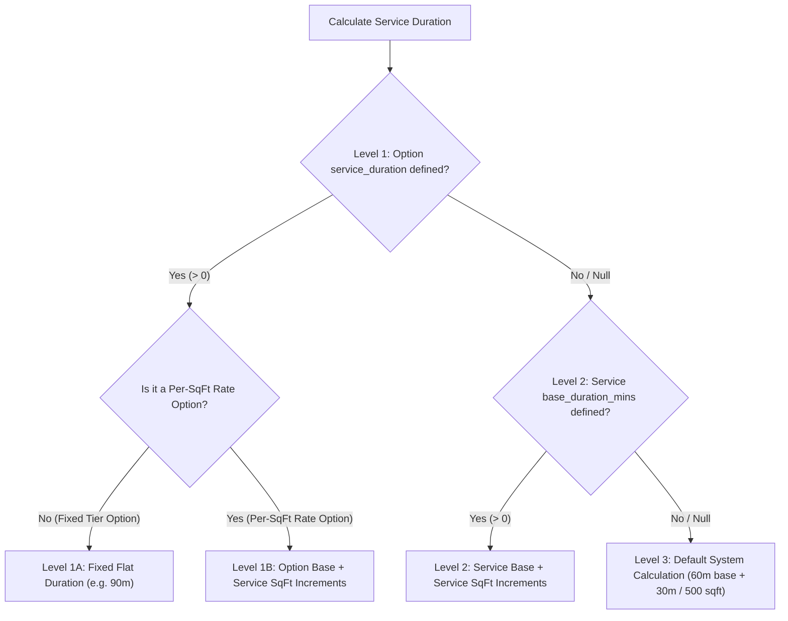
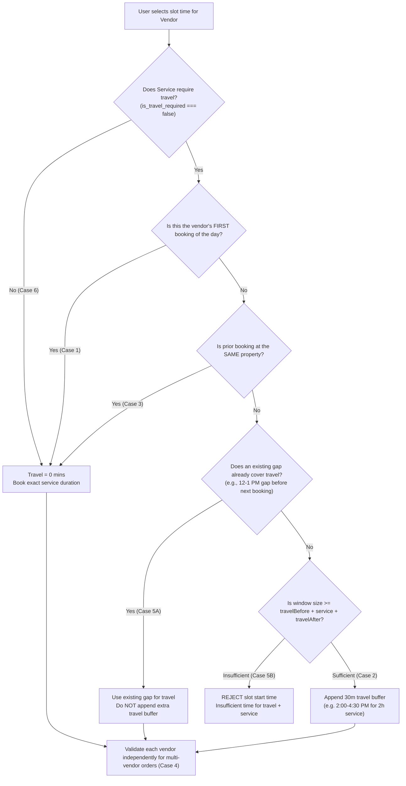
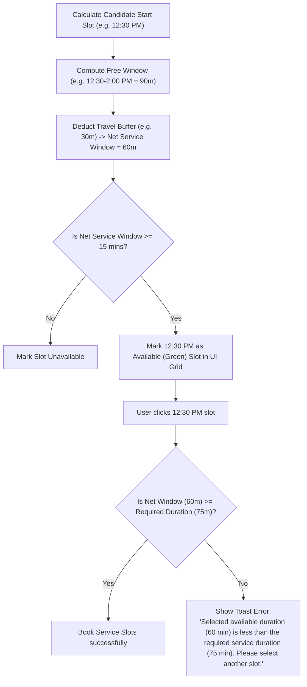

# Summary of Today's Changes & Testing Guide

This document details all technical updates implemented today in the Order Schedule and Calendar modules, their expected behaviors, step-by-step testing instructions, and potential edge cases/regression areas to monitor.

---

## Table of Contents
1. [Feature 1: Calendar Time Axis Trimming (Removing Non-Operating Slots)](#feature-1-calendar-time-axis-trimming)
2. [Feature 2: 3-Tier Priority Hierarchy for Service Duration Calculation](#feature-2-3-tier-priority-hierarchy-for-service-duration-calculation)
3. [Feature 3: Dynamic Vendor Travel Time Adjustment (6 Business Cases)](#feature-3-dynamic-vendor-travel-time-adjustment)
4. [Feature 4: Partial Slot Display & Toast Error Notification](#feature-4-partial-slot-display--toast-error-notification)
5. [Feature 5: Common Booked Slots, Travel Adjustments & Vendor Breaks Display](#feature-5-common-booked-slots-travel-adjustments--vendor-breaks-display)
6. [Feature 6: Agent vs Admin Role-Based Calendar Bounds & Clickability Rules](#feature-6-agent-vs-admin-role-based-calendar-bounds--clickability-rules)
7. [Modified Files List](#modified-files-list)

---

## Feature 1: Calendar Time Axis Trimming

### Problem Solved
Previously, FullCalendar rendered 15-minute empty grid rows starting from `12:00 AM` to `12:00 AM` (24 hours) regardless of vendor working hours. Users had to scroll past empty 12 AM – 7 AM rows to see active day slots.

---

## Feature 2: 3-Tier Priority Hierarchy for Service Duration Calculation

---

## Feature 3: Dynamic Vendor Travel Time Adjustment

---

## Feature 4: Partial Slot Display & Toast Error Notification

---

## Feature 5: Common Booked Slots, Travel Adjustments & Vendor Breaks Display

### Complete Calendar Badge Matrix

| Slot Type | Title | Badge Styling | Background Color | Text Color | Admin Clickable? | Agent Clickable? |
| :--- | :--- | :--- | :--- | :--- | :--- | :--- |
| **Available / Recommended** | `"Available"` / `"MO"` | `.slot-available` | Soft Green `#B2FFB2` | Dark Green `#166534` | ✅ YES | ✅ YES |
| **Travel Buffer** | `"Travel Adjustment"` | `.slot-travel-adjustment` | Amber `#FDE68A` | Dark Amber `#92400E` | ℹ️ Inspect | ❌ **NO (Not clickable)** |
| **Booked Appointment** | `"Booked"` | `.slot-booked` | Slate `#CBD5E1` | Dark Slate `#1E293B` | ❌ **NO** | ❌ **NO** |
| **Vendor Break** | `"Vendor Break"` | `.slot-vendor-break` | Soft Indigo `#E0E7FF` | Dark Indigo `#3730A3` | ℹ️ Inspect | ❌ **NO** |
| **Off-Hours / Time-Off** | `"Unavailable"` | `.slot-unavailable` | Light Gray `#EEEEEE` | Gray `#424242` | ❌ **NO** | ❌ **NO** |

---

## Feature 6: Agent vs Admin Role-Based Calendar Bounds & Clickability Rules

### 1. Time Axis Trimming with Travel Adjustments Included
- **Admin (`userType === "admin"`)**: Sees full day operating hours (`dayStartTime` to `dayEndTime`) including leading & trailing booked blocks.
- **Agent / Client (`userType !== "admin"`)**:
  - `activeIndices` includes `slot-available`, `slot-selected`, `slot-recommended`, AND `slot-travel-adjustment`.
  - Leading travel buffers (e.g. `12:00 PM - 12:30 PM` before `12:30 PM` available slot) are included in the agent grid (`slotMinTime` = `12:00 PM`).
  - Travel adjustment slots are clearly labeled as **"Travel Adjustment"** (`#FDE68A` amber badge).
  - Trailing booked/unavailable blocks are trimmed off the time axis.

### 2. Slot Clickability Guards
- **Booked Slots**: Blocked from being clicked by ANY user (Admin or Agent). Hover cursor displays `not-allowed` (🚫).
- **Vendor Break & Travel Adjustment Slots**: Blocked from being clicked by Agents (`userType !== "admin"`). Hover cursor displays `not-allowed` (🚫).

---

## Step-by-Step Testing Guide

1. **Agent Travel Adjustment Visibility Test**:
   - Login as Agent. Schedule has travel adjustment buffer at `12:00 PM - 12:30 PM` before `12:30 PM` available slot.
   - **PASS**: Agent grid starts at `12:00 PM`. `12:00 PM - 12:30 PM` displays label **"Travel Adjustment"** with amber badge styling (`#FDE68A`) and `not-allowed` cursor.
2. **Admin Full Schedule View Test**:
   - Login as Admin.
   - **PASS**: Admin grid shows full operating hours with all booked, break, travel, and available slots.

---

## Modified Files List

| File Path | Description of Changes |
| :--- | :--- |
| [`app/dashboard/orders/utils/serviceTimeUtils.ts`](file:///c:/Users/NVT-HP-18/Desktop/bcf-admin/app/dashboard/orders/utils/serviceTimeUtils.ts) | Implemented 3-tier hierarchy in `getEffectiveServiceDuration` with flexible overload parameters and per-sqft rate handling. |
| [`app/dashboard/orders/components/OneDayCalendar.tsx`](file:///c:/Users/NVT-HP-18/Desktop/bcf-admin/app/dashboard/orders/components/OneDayCalendar.tsx) | Updated Agent time bounds trimming to include `slot-travel-adjustment`, enforced non-clickability for booked/travel/break slots, and added `cursor: not-allowed` CSS rules. |
| [`app/dashboard/calendar/components/OneDayCalendar.tsx`](file:///c:/Users/NVT-HP-18/Desktop/bcf-admin/app/dashboard/calendar/components/OneDayCalendar.tsx) | Integrated travel buffer logic, dynamic `slotMinTime`/`slotMaxTime` props, and updated all `getEffectiveServiceDuration` call sites. |
| [`app/dashboard/orders/components/Schedule.tsx`](file:///c:/Users/NVT-HP-18/Desktop/bcf-admin/app/dashboard/orders/components/Schedule.tsx) | Updated duration calculation calls to pass `productOption`, `currentService`, and `squareFootage`. |
